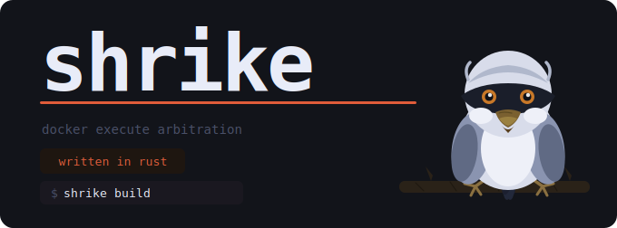

# Shrike - Docker Execution Arbitration

[](#) [](https://github-ci.code-ape.dev/repos/7) [](https://github-ci.code-ape.dev/repos/7)
> [!CAUTION]
> This project was partly generated by utilizing a LLM. It's not designed for general use. It is created to fullfill a specific need in my personal development environment. Better tools most likely exist for this task - in this case, feel free to let me know.

## What it does

Shrike runs commands inside a persistent Docker container that has your git repository mounted at `/workspace`. The container lives as long as you need it — subsequent invocations reuse the same container rather than starting a new one each time — so build caches, installed dependencies, and other state survive across calls.

The typical workflow is to define short *aliases* for the commands you run repeatedly (configure, build, test, lint, shell), then invoke them as:

```
shrike build
shrike test
shrike ci          # pipeline: configure → build → test
shrike shell       # interactive TTY
shrike cmake --build build   # literal pass-through, no alias needed
```

Shrike resolves which container to use from the current git repository root and the active profile, so you can have different images and aliases per project or per toolchain without any manual management.

## Configuration

Configuration is written in TOML and layered from three sources. Higher-priority layers override lower-priority ones field by field; aliases are merged by name.

| Priority | File | Purpose |
|---|---|---|
| 3 (highest) | `~/.shrike.d/<name>.toml` | Personal per-project overrides (not committed) |
| 2 | `<git-root>/.shrike.toml` | Repository defaults (committed, shared with team) |
| 1 (lowest) | `~/.shrike.toml` | Global personal defaults |

The file in `~/.shrike.d/` is matched by scanning all `*.toml` files alphabetically and using the first one whose `pattern` field (an ERE regex) matches the absolute path of the current git root.

### Schema

All config files share the same flat schema. Top-level TOML tables are profile names; subtables inside them are aliases.

```toml
[profile-name]
image      = "image:tag"        # Docker image to pull/use
dockerfile = "path/to/file"     # build image locally instead (relative to this file)
env        = ["KEY", "K=V"]     # env vars injected into every command
ports      = ["8080:8080"]      # published ports (fixed at container creation)
volumes    = ["/host:/container"] # extra volume mounts
user       = "$(id -u):$(id -g)" # user for docker exec (supports $(...))
setup      = "command"          # runs once on container creation

[profile-name.alias-name]
cmd         = "shell command"   # command run via sh -c inside the container
desc        = "description"     # shown in --list output
workdir     = "/workspace"      # working directory (defaults to mirror of host CWD)
env         = ["EXTRA=1"]       # alias-specific env (merged with profile env)
user        = "root"            # override user for this alias only
interactive = true              # always allocate a TTY (docker exec -it)
hidden      = true              # hide from --list; still usable in pipelines
pipeline    = ["a", "b", "c"]  # run aliases in order, stop on first failure
```

The `[project]` section is special and only meaningful in the repo and per-project files:

```toml
[project]
profile = "default"             # profile to activate in this repository
pattern = ".*/myproject(/.*)?$" # ERE regex (per-project files only)
```

### Env var forms

Three forms are accepted anywhere `env` appears:

| Form | Behaviour |
|---|---|
| `"KEY"` | Pass the host value of `KEY`; skip silently if unset |
| `"KEY=VALUE"` | Set `KEY` to a fixed value |
| `"KEY=$(cmd)"` | Evaluate `cmd` on the host at invocation time |

### Container lifecycle

Each `(git-root, profile)` pair gets one container, named `shrike-<slug>-<profile>`. Shrike starts it if it is stopped, or creates it if it does not exist. The workspace volume, ports, and any extra volumes are bound at creation time; use `--restart` to recreate the container after changing those settings.

```
shrike --restart build    # tear down and recreate container, then run
shrike --rebuild build    # force docker build/pull before running
shrike --stop             # remove this project's container
shrike -S                 # remove all shrike-managed containers
```
